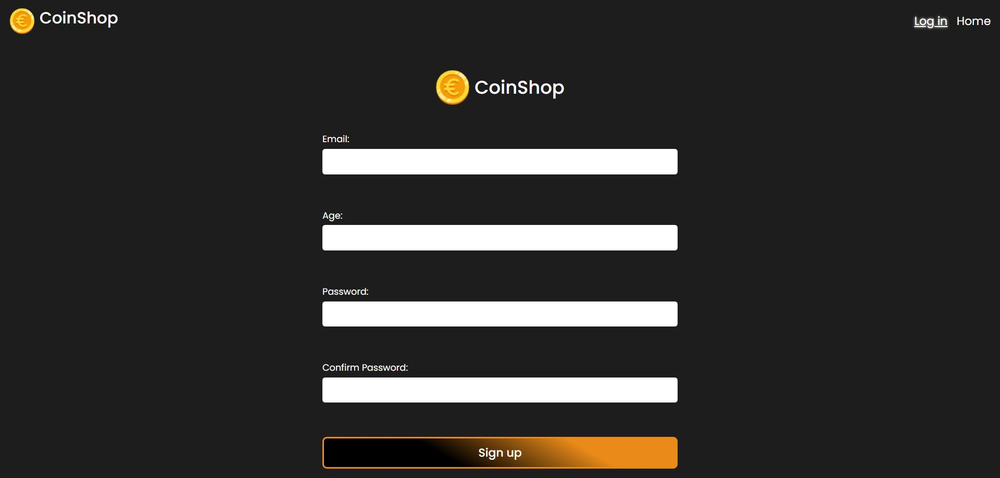
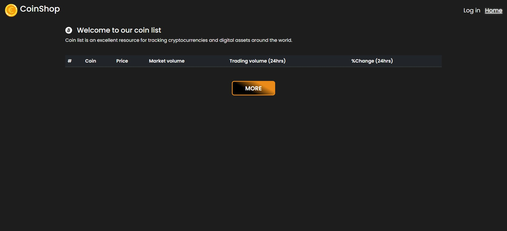

# CoinShop - Cryptocurrency Tracking App
Welcome to Coinmania, your go-to resource for tracking cryptocurrencies and digital assets worldwide. This project utilizes React, Vite, and various other technologies to provide users with real-time information about cryptocurrencies.

## Features
Home Page: View a list of cryptocurrencies, including their names, symbols, prices, market volumes, trading volumes (24 hours), and percentage change (24 hours).

## Coin List

Coin Details Page: Explore detailed information about a specific cryptocurrency, including market volume, supply, price change, 24-hour change percentage, and 24-hour volume percentage.

## Coin Details

Load More: Load additional cryptocurrencies to explore beyond the initial list.

Authentication Page: Sign up to access personalized features and save preferences.

## Technologies Used
React: A JavaScript library for building user interfaces.
Vite: A fast build tool for modern web development.
axios: A promise-based HTTP client for the browser and Node.js.
Chart.js: A simple yet flexible JavaScript charting library.
formik: A form library for React to handle form state and validation.
millify: A utility to format large numbers into a readable format.
yup: A JavaScript schema builder for value parsing and validation.

